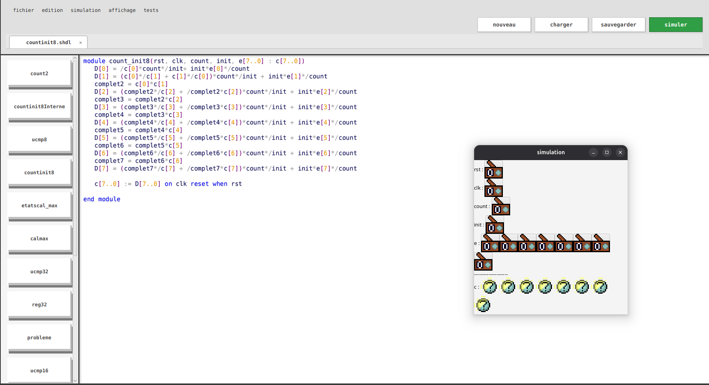

# ArchiDu7 — simulateur SHDL

Application **JavaFX** qui interprète et **simule des circuits logiques** décrits
en langage **SHDL**. Un script SHDL est analysé (lexer → parser LL(1) → arbre
syntaxique), converti en circuit, puis simulé par propagation des signaux dans
une fenêtre dédiée. L'interface offre un éditeur de code avec coloration
syntaxique, un panneau de modules et un thème clair/sombre.



Projet Long 1SN — ENSEEIHT. **Prérequis : JDK 25.**

## Arborescence

| Chemin | Contenu |
|--------|---------|
| [`src/`](src/) | Code source. Point d'entrée [`ArchiDu7`](src/ArchiDu7.java). |
| `src/parser/` | Lexer, grammaire **LL(1)** table-driven, CST, conversion CST → circuit. |
| `src/simulateur/` | Modèle de circuit et moteur de simulation par propagation. |
| `src/editeur/` | Éditeur de texte (deux calques) + coloration syntaxique. |
| `src/boutons/`, `src/sauvegarde/` | Barre d'actions, persistance des fichiers `.shdl`. |
| [`modules/`](modules/) | Modules SHDL d'exemple chargés au démarrage. |
| [`livrables/`](livrables/) | Rapports (PDF) et diagrammes UML ; sources LaTeX dans [`livrables/latex/`](livrables/latex/). |
| [`docs/`](docs/) | Specs de conception ([`docs/specs/`](docs/specs/)) et organisation de l'équipe. |

## Documents clés

- **Rapport final** : [`livrables/rapport-final.pdf`](livrables/rapport-final.pdf) — vue d'ensemble + diagrammes de classes (parser, simulation, éditeur, interface).
- **Manuel utilisateur** : [`livrables/manuel-utilisateur3.pdf`](livrables/manuel-utilisateur3.pdf).
- **Rapports individuels** : [`livrables/`](livrables/) (`rapportN-<login>.pdf`).

## Lancer l'application

### Le plus simple : build CI

Onglet **Actions** → dernier run `build jar` → télécharger l'artefact de son OS
(`JavaFX-Assignment-...`) → dézipper → lancer `run.sh` (Linux/macOS) ou
`run.bat` (Windows). Rien à installer hormis le JDK.

### Build local

`lib/` n'est pas versionné : télécharger **JavaFX 25.0.3** sur
[gluonhq.com](https://gluonhq.com/products/javafx/) et copier **tout le contenu**
de `javafx-sdk-25.0.3/lib/` (jars **et** natifs) dans `lib/`. Puis :

```sh
make build           # Linux / macOS
java -jar archidu7.jar
```

Windows (sans make) :
```powershell
mkdir bin; Copy-Item src/assets bin/assets -Recurse -Force
cd src; javac -d ../bin -cp "../lib/*;." App.java; cd ..
jar --create --file=archidu7.jar --manifest src/META-INF/MANIFEST.MF -C bin .
```

## Tests

La suite de tests JUnit vit dans [`tests/`](tests/) (séparée du code, comme
souhaité), avec JUnit 4.13.2 + Hamcrest dans `tests/lib/`. Lancer :

```sh
make test
```

267 tests couvrent le parser (lexer, grammaire LL(1), CST), la conversion
(combinatoire, vecteurs, appels de sous-modules) et la simulation. Quelques
tests sont marqués `@Ignore` : ils proviennent de la branche
`test/bascule-d-integration` et ciblent des évolutions de la conversion/du
séquentiel non encore intégrées sur `main` (à réconcilier).

## Modules

L'app lit le dossier `modules/` du répertoire de travail. Lancée depuis la
racine, elle charge les modules d'exemple du dépôt ; le bouton **charger**
permet de pointer un autre dossier de travail.
